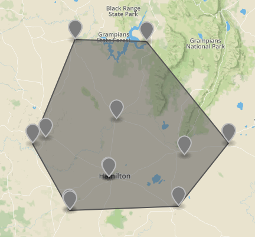

# Convex example

This example takes points and creates a FeatureCollection of convex polygon.

The example use the following Turf methods:

[`turf.convex()`](http://turfjs.org/docs#convex) method which transforms the points into a convex hull polygon.

The output of convex polygon:

<!--  -->
