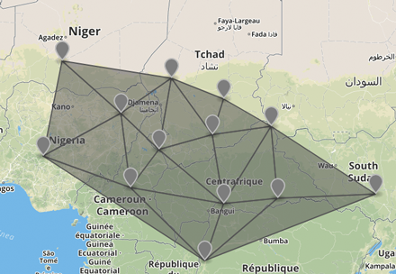

# TIN example

This example takes random points and creates an interpolated Triangulated Irregular Network.

The example uses the Turf [`turf.tin()`](http://turfjs.org/docs#tin) method to calculate the buffer.

Input points and output TIN polygons:

