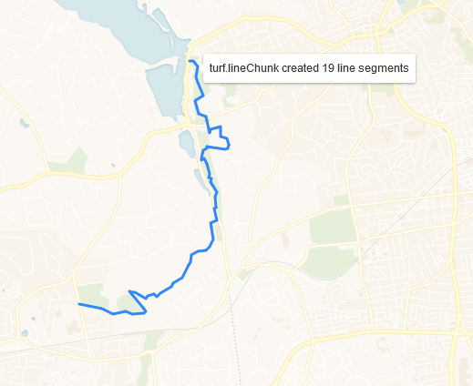

# lineChunk Route Example

This example takes a line and divides it into 0.25 mile intervals, adds the line segments to the map, and console.logs the number of line segments created.

The example uses the Turf
[`turf.lineChunk()`](http://turfjs.org/docs#lineChunk) method to create the line segments.

