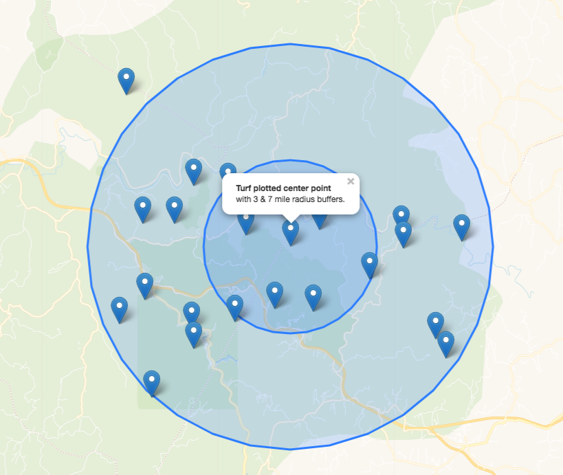

# Center points example

This example takes points and determines the center point of all points.  Then it places a 3 and 7 miles buffer around the center point, adds all points and the buffers to the map.

The example use the following Turf methods:

[`turf.points()`](http://turfjs.org/docs#point) method accepts layer coordinates and returns a new point feature to load into an array of coordinates.

[`turf.featureCollection()`](http://turfjs.org/docs#featureCollection) method turns the array of coordinates into a featureCollection for turf processing.

[`turf.center()`](http://turfjs.org/docs#center) method accepts the featureCollection created by turf.points and returns the center point of all points.

[`turf.buffer()`](http://turfjs.org/docs#buffer) method to calculate the buffer around the turf.center point.

<!--  -->
